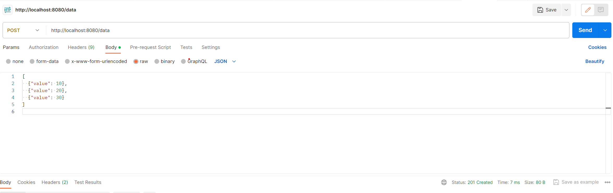
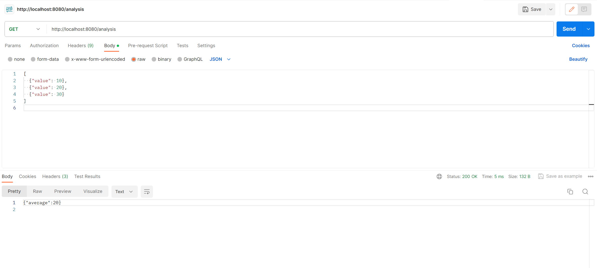

Golang RESTful API Demo
============================

This project is a simple backend that demonstrates creating RESTful API endpoints in Golang. The pupose of the API can be anything, but for this I chose to make its purpose for submitting data points and retrieving analysis results.

## Table of Contents


-   [Installation](#installation)
-   [Usage](#usage)
-   [API Endpoints](#api-endpoints)
    -   [Submit Data (`POST /data`)](#submit-data-post-data)
    -   [Retrieve Analysis Results (`GET /analysis`)](#retrieving-analysis-results)
-   [Images](#images)

-   [Contributing](#contributing)

## Installation


1.  Ensure you have Golang installed on your machine. If not, you can download it from https://golang.org/dl/.

2.  Clone the repository:

    bash

-   `git clone https://github.com/amy324/RESTful-API-Demo-Golang`

    -   Navigate to the project directory:

    bash

    -   `cd RESTful-API-Demo-Golang`

    -   Run the project:

    bash

1.  `go run main.go`

    The server will be accessible at http://localhost:8080.

## Usage


### Submitting Data

To submit data points, make a POST request to `/data` with a JSON body containing an array of data points. Each data point should have a numerical value.

#### Example Request:

```
bash

POST http://localhost:8080/data
Content-Type: application/json

[
  {"value": 10},
  {"value": 20},
  {"value": 30}
]
```

### Retrieving Analysis Results

To retrieve analysis results, make a GET request to `/analysis`.

#### Example Request:

```
bash

`GET http://localhost:8080/analysis`
```

#### Example Response:

```
json

{
  "average": 20
}

```

## API Endpoints


### Submit Data (`POST /data`)

Submit an array of data points for analysis.

-   **Endpoint**: `/data`
-   **Method**: POST
-   **Request Body Format**: JSON array

    json

-   `[
      {"value": 10},
      {"value": 20},
      {"value": 30}
    ]`

-   **Response Status Code**: 201 Created
-   **Response Body Format**: None

### Retrieve Analysis Results (`GET /analysis`)

Retrieve the analysis results, including the average of submitted data.

-   **Endpoint**: `/analysis`
-   **Method**: GET
-   **Response Status Code**: 200 OK
-   **Response Body Format**:

    json

-   `{
      "average": 20
    }`


## Images

Below are screenshots from [Postman](https://www.postman.com/) API Platform, which shows the expected results when testing this API.



A successful POST request to `/data` with a JSON body containing an array of data points.



A successful GET request to `/analysis`, which has retrieved the average of the data points above.


## Contributing


Contributions are welcome! Feel free to open issues or submit pull requests.

